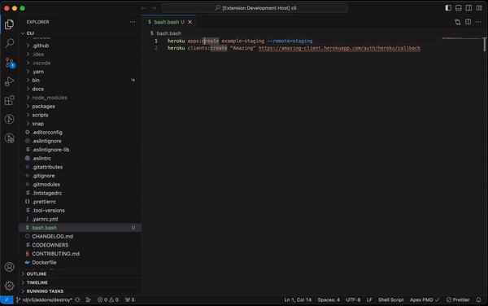

# heroku-vscode

The Heroku VSCode extension provides tooling for authoring shell scripts that call the [Heroku-cli](https://devcenter.heroku.com/articles/heroku-cli)
for the creation and management of Heroku apps.

## Features

### Shell script hover information
